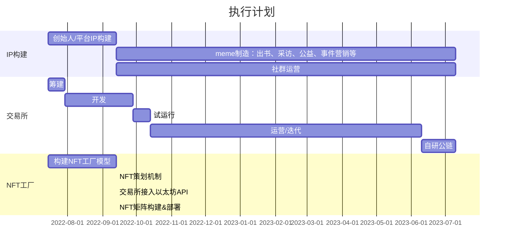

<!-- 微信留言

这样我们也可以正常的进行招商代理，链游


做metroverse中国独代就可以作为GameFi的第一个业务，在模式确定后我再给他们发邮件。

如果我们仅是一个新平台，没有优势，而且还没上线
如果我们是国内的nft平台
又有特色，那样成功率较高
国内的加密钱包是违法的


思路成熟后，我会通过发邮件的方式：contact@metroverse.com(官方

就以 Metroverse为例，账户是基于以太坊钱包的，这个在国内就走不通了，但从技术上也可在国内平台开户时自动生成一个地址，但之后涉及到的eth支付等都涉及到“汇率”问题，具体的步骤还在梳理。

GameFi在国内做的话，还是以代理的方式会更容易推广，核心也同样是分润机制，在去掉“代币”相关后，也是能实现合规性。


-->
<h1>链游聚合平台(GameFi)可行性提案</h1>

<div style="height:30px"></div>
[toc]
<div style="height:30px"></div>

## 1. 前言

平台先命名为魔法屋
魔法屋是一个区块链游戏聚合平台，通过构建一个链游聚合入口为玩家提供丰富的一站式游戏体验，不同链游中的NFT资产可以在魔法屋上流通，玩家可以统一管理不同链游的账户而无需切换区块链网络。


## 2. 背景

所以在国内不能做交易所，也需要无币化运营，以达到合规性要求。
所以国内的做法还需要时间去沉淀。

相对于数字藏品，GameFi有价值支撑：用户的感情、时间、金钱的投入。

### 2.1. 元宇宙
元宇宙是人类的未来，不仅是因为它包含的想象力，更重要的是它能够解决人类所面临最紧迫的问题：社会的持续稳定。生产力提升带来就业被压缩、消费减少而产生经济危机导致的社会动荡，周而复始，就像一个死循环一样无解。
所以若能让 生产 = 消费 则能解除上述循环，而元宇宙的出现使得 消费本身就是生产成为可能，元宇宙中数据就是生产资料，通过消费过程来生产数据，只要生产效率足够高、生产规模足够大、生产出来的数据差异化足够强，经济飞轮就能持续转动起来。
### 2.2. GameFi
基于元宇宙这一宏大的叙事背景，能够帮助用户建立起身份系统和价值系统则成为元宇宙初期最大的机会，因为这是在元宇宙生活工作的基石，而GameFi又无疑是该领域最好的赛道。
元宇宙由不同的空间组成，链游是当前阶段最具价值的空间之一：有情感、时间、资金的投入搭建起来的价值支撑体系：
GameFi = Game + DeFi + NFT
Game的可玩性融合了用户的时间、精力、金钱，NFT在于为Game赋予价值，DeFi是技术基础，数据所有权属于用户，真正是用户的实际资产，传统游戏是不可能实现的；
目前简版的链游，Playto Earn，也能够是用户行为上瘾。
链游相对于传统游戏
    不会因为服务器问题或运营商问题导致游戏资产消失
    增信：通过规则的制定和流程控制，更好的解决不透明与信任问题
    传统游戏里的角色及相关道具资产的所有权、解释权均属游戏开发公司，用户仅有使用权，这是有判定案例的，这一块国内的法律已经明确。
链游运营在公链上，公链众多导致
    痛点I： 玩家需要根据不同的市场热点切换不同的区块链网络去体验，操作及其麻烦，
    痛点II：不同链上的游戏资产只能在个资所处的公链上流通
综上所诉
    在游戏中，国界、地域、年龄、性别都不再重要
    人们通过游戏作为良好的互动载体，产生新的社会关系
    链游(GameFi)会成为元宇宙的爆发点，因为同时具备了
        社交属性，社交资本
        价值(生产&金融)属性

目前，链游和传统游戏的核心区别在于
- 链游是Play To EARN
- 传统游戏是 Play For FUN
链游的好处在于全球范围，

如果把这两个

GameFi = Game + DeFi + NFT
NFT在于为Game赋予价值，DeFi是技术基础，数据所有权属于用户，真正是用户的实际资产，传统游戏是不可能实现的；
目前简版的链游，Playto Earn，也能够是用户行为上瘾。


推广重心放在中国，就以为着以下业务不能开展：
<ol>
  <li> 平台币
  <li> 加密钱包
</ol>

那平台的核心业务和盈利模式就完全变了，
平台币和钱包业务都不能开展。

推广营销方式会改变：
这一块我之前有过一个思路，就是以儿童作为切入点

不过以GameFi作为重点也许更好，

现在的链游大部分都没有手机端，以PC web为主，08年开始流行的网页游戏如：开心农场、抢车位等非常类似，但制作难度还更低。

## 3. 可行性方案: 0xroom.com魔法屋

### 3.1. 魔法屋
魔法屋基于 房屋 和 门 的构建出一个隐喻系统
```
  门：类似一个快捷方式，对应 一个具体的游戏或者另一个房屋
        当门 指向一个具体的链游时，会打开一个“世界”
    房屋：类似一个文件夹，里面有更多的门、房屋
        房屋会统计包含的门和房屋的资产变化情况
    世界
        对应游戏的简要描述
        在游戏中的资产概括
```
流动性挖矿

价值
    
魔法屋V2会形成一个单独的区块链网络，降低用户的链上操作成本。将纳入传统游戏，即游戏本身可以在链下运行，游戏中的角色及道具等资产可根据需求铸造成NFT上链，并在游戏之外进行交易，这样不但提升用户了游戏体验，也帮传统游戏开发商将玩家资产一键上链，协助其在web3时代的转换成本，当然这是一个过度手段。
    
### P2E：玩赚链游
免费玩游戏已经是过去的事情了，Free-to-Play is so 2010...
在魔法屋，你可以通过玩游戏赚钱，魔法屋通过奖励模型(Rewarding Model)为玩家和公会赋能，以现实世界的价值去激励玩家、公会、投资者、游戏开发者去玩和创造。
0xroom unloacked through 0xroomRewardingModel for players and creators, who will have strong incentives to play and create with rewards that have real-world value.

**在魔法屋怎样赚钱**
- 玩游戏，赚钱奖励
- 构建游戏，将游戏货币化，build games, monetize thme
- 创建资产，将其市场化，create assets, market them

### 3.2. 链游
目标：
1. 赠送空投
2. 独代

我们的特色？
我们能给ME提供什么？
我们是一个平台，但还没上线，没有公信力！！！

### 3.3. NFT 游戏
mint

## 4. 实施步骤

### 4.1. 第一阶段：工作室
工作室：合伙制
    不进行叙事，闷声赚钱
    不进行叙事构建
    学习NFT的白名单制度，不面向散户，本质也是代理制
运营
    构建社区/社群
    做品牌就是建设社区，构建好认知与共识后再做产品，再构建IP
    社群结构
        NFT持有者
        Token持有者
        一般用户
    一个NFT项目的社区上万人，持有者上千人，这个就类似传统品牌的转化率
    性质：物理的个体散落在世界各地，但人却通过区块链网络紧密的链接在一起：利益共同体。
营销
### 4.2. 第二阶段：国际
    营销
## 5. 营销
借鉴NFT的WhiteList制度，我们也采用邀请制（类似代理制）。
国内的NFT禁止二级市场交易


## 6. 财务分析
略

## 7. 案例分析：Metroverse
PVP: 用户对战，会使得可玩性大幅提高，而不仅仅是打金了；

### 7.1. 思路
如果我们仅是一个新平台，没有优势，而且还没上线
如果我们是国内的nft平台
又有特色，那样成功率较高
国内的加密钱包是违法的


先全方位了解一下 metroverse，确定好了说辞和合作方案，再通过发邮件的方式联系
contact@metroverse.com(官方邮件)


### 7.2. metroverse 分析

思路成熟后，我会通过发邮件的方式：



